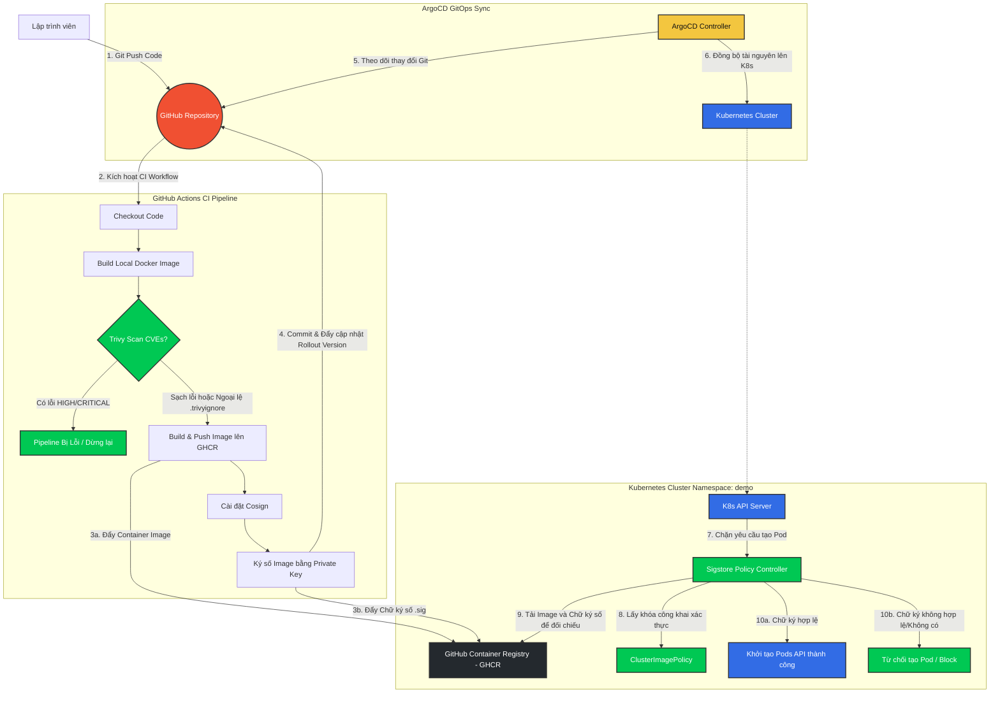

# Hệ Thống GitOps & DevSecOps Pipeline Toàn Diện Trên Kubernetes

Dự án này là một mô hình thực hành hoàn chỉnh về triển khai ứng dụng tự động hóa qua luồng **GitOps (ArgoCD)** kết hợp với các tiêu chuẩn bảo mật nghiêm ngặt **DevSecOps (Sigstore/Cosign, OPA Gatekeeper, Trivy)** và hệ thống giám sát **Observability (Prometheus, Alertmanager)**.

---

## 🚀 Các Tính Năng Nổi Bật

- 🔄 **GitOps (App-of-Apps Pattern)**: Quản lý toàn bộ cấu hình hạ tầng và ứng dụng một cách nhất quán trực tiếp từ Git bằng ArgoCD thông qua [root.yaml](file:///d:/GitHub/rbac_admission/argocd/root.yaml).
- 🛡️ **DevSecOps & Supply Chain Security**:
  - **Trivy**: Quét lỗ hổng bảo mật cấp độ OS & Library trong Docker Image ngay tại pipeline trước khi đẩy lên registry. Hỗ trợ cơ chế ngoại lệ có thời hạn qua [.trivyignore](file:///d:/GitHub/rbac_admission/.trivyignore) (xem chi tiết tại [adr-cve-exception.md](file:///d:/GitHub/rbac_admission/runbooks/adr-cve-exception.md)).
  - **Cosign (Sigstore)**: Ký số Container Image tại CI pipeline bằng khóa bí mật lưu trong GitHub Secrets.
  - **Sigstore Policy Controller**: Triển khai Admission Webhook trên cụm Kubernetes để chặn bất kỳ Pod nào sử dụng Image không có chữ ký số hợp lệ khớp với khóa công khai [cosign.pub](file:///d:/GitHub/rbac_admission/signing/cosign.pub).
- 🚦 **Progressive Delivery (Canary Deployment)**: Sử dụng **Argo Rollouts** kết hợp với **Prometheus Analysis** để phân tách traffic thông minh (10% -> 50% -> 100%). Tự động hoàn tác (Auto Rollback) về phiên bản an toàn trước đó nếu success rate giảm dưới 90% (xem [rollout.yaml](file:///d:/GitHub/rbac_admission/app-api/rollout.yaml)).
- 🔐 **Quản lý Secrets Động**: Sử dụng **External Secrets Operator (ESO)** để đồng bộ mật khẩu từ nhà cung cấp ngoài vào Kubernetes. Cấu hình mount volume dạng file giúp xoay vòng (rotate) mật khẩu tự động mà không cần khởi động lại Pod (xem [runbook-rotate-secret.md](file:///d:/GitHub/rbac_admission/runbooks/runbook-rotate-secret.md)).
- 📊 **Giám sát & Cảnh báo (Monitoring & Alerting)**: Tích hợp ServiceMonitor để Prometheus scrape metrics của Flask API, tự động kích hoạt Rule cảnh báo gửi Email khi success rate tổng thể của API giảm dưới 95%.

---

## 📐 Sơ Đồ Kiến Trúc Hệ Thống

Dưới đây là luồng hoạt động tích hợp từ khi nhà phát triển đẩy mã nguồn lên Git cho tới khi ứng dụng được xác thực và khởi chạy trên cụm Kubernetes:



---

## 📁 Cấu Trúc Thư Mục Dự Án

| Thư mục / Tệp tin | Vai trò & Mô tả |
| :--- | :--- |
| [`.github/workflows/`](file:///d:/GitHub/rbac_admission/.github/workflows) | Chứa các pipeline tự động hóa: [build-push.yml](file:///d:/GitHub/rbac_admission/.github/workflows/build-push.yml) (CI, Quét lỗi, Ký số, GitOps version bump) và [validate.yml](file:///d:/GitHub/rbac_admission/.github/workflows/validate.yml). |
| [`app-alert/`](file:///d:/GitHub/rbac_admission/app-alert) | Định nghĩa Recording & Alerting Rules của Prometheus ([prometheus-rules.yaml](file:///d:/GitHub/rbac_admission/app-alert/prometheus-rules.yaml)) giám sát SLO của API. |
| [`app-analysis/`](file:///d:/GitHub/rbac_admission/app-analysis) | Cấu hình [analysis-template.yaml](file:///d:/GitHub/rbac_admission/app-analysis/analysis-template.yaml) dùng Prometheus query để phân tích tự động khi Canary Rollout. |
| [`app-api/`](file:///d:/GitHub/rbac_admission/app-api) | Cấu hình triển khai chính của ứng dụng API Flask gồm [rollout.yaml](file:///d:/GitHub/rbac_admission/app-api/rollout.yaml), [service.yaml](file:///d:/GitHub/rbac_admission/app-api/service.yaml), [servicemonitor.yaml](file:///d:/GitHub/rbac_admission/app-api/servicemonitor.yaml). |
| [`argocd/`](file:///d:/GitHub/rbac_admission/argocd) | Điểm khởi đầu cấu hình GitOps: Tệp [root.yaml](file:///d:/GitHub/rbac_admission/argocd/root.yaml) và thư mục `apps/` chứa khai báo 11 ứng dụng thành phần. |
| [`eso/`](file:///d:/GitHub/rbac_admission/eso) | Cấu hình Secret Store giả lập và External Secret đồng bộ mật khẩu cho ứng dụng. |
| [`gatekeeper/`](file:///d:/GitHub/rbac_admission/gatekeeper) | Chứa các quy tắc bảo mật OPA Gatekeeper ([ConstraintTemplates](file:///d:/GitHub/rbac_admission/gatekeeper/constraints/00-constrainttemplates.yaml) & [Constraints](file:///d:/GitHub/rbac_admission/gatekeeper/constraints/10-constraints.yaml)). |
| [`policies/`](file:///d:/GitHub/rbac_admission/policies) | Khai báo [cluster-image-policy.yaml](file:///d:/GitHub/rbac_admission/policies/cluster-image-policy.yaml) dùng để xác thực chữ ký ảnh bằng Public Key. |
| [`rbac/`](file:///d:/GitHub/rbac_admission/rbac) | Phân quyền truy cập cụm K8s cho các nhóm vai trò Developer, SRE, Viewer. |
| [`signing/`](file:///d:/GitHub/rbac_admission/signing) | Chứa khóa công khai [cosign.pub](file:///d:/GitHub/rbac_admission/signing/cosign.pub) dùng để xác thực chữ ký của ảnh. |
| [`src/api/`](file:///d:/GitHub/rbac_admission/src/api) | Mã nguồn API viết bằng Flask ([app.py](file:///d:/GitHub/rbac_admission/src/api/app.py)) và [Dockerfile](file:///d:/GitHub/rbac_admission/src/api/Dockerfile) đóng gói image. |
| [`runbooks/`](file:///d:/GitHub/rbac_admission/runbooks) | Chứa các tài liệu hướng dẫn chuyên sâu về kiến trúc, xoay vòng secret, chữ ký ảnh, v.v. |

---

## 🛠️ Hướng Dẫn Vận Hành & Sử Dụng

### 1. Điều kiện tiên quyết (Prerequisites)

- Một cụm Kubernetes đang chạy (khuyên dùng Minikube với profile `w10`).
- Công cụ CLI: `kubectl`, `helm`, `cosign`.
- Trình quản lý GitOps: ArgoCD đã được cài đặt sẵn trên cụm.

### 2. Khởi động hệ thống (Bootstrap qua ArgoCD)

Áp dụng tệp tin Root Application để khởi động cấu hình toàn bộ cụm:
```bash
kubectl apply -f argocd/root.yaml
```
Lệnh này sẽ cài đặt tất cả các công cụ bổ trợ (OPA Gatekeeper, Sigstore Policy Controller, External Secrets Operator, Prometheus Stack) và các cấu hình ứng dụng trong thư mục [argocd/apps/](file:///d:/GitHub/rbac_admission/argocd/apps).

### 3. Kích hoạt Xác thực Chữ ký trên Namespace

Ban đầu, nhãn kích hoạt xác thực chữ ký ảnh sẽ được comment trong file [demo-namespace.yaml](file:///d:/GitHub/rbac_admission/app-common/demo-namespace.yaml) để phục vụ quá trình cài đặt ban đầu. Sau khi image đầu tiên đã được build và ký số thành công tại CI pipeline, hãy bật xác thực bằng cách chạy lệnh:
```bash
kubectl label ns demo policy.sigstore.dev/include=true --overwrite
```

---

## 🧪 Các Kịch Bản Thử Nghiệm Chính (Test Scenarios)

### Kịch bản 1: Triển khai Version mới thành công (Happy Path)
- **Hành động**: Chỉnh sửa mã nguồn tại [app.py](file:///d:/GitHub/rbac_admission/src/api/app.py), thiết lập `ERROR_RATE = "0"`. Commit và push lên Git.
- **Diễn biến**: Pipeline GitHub Actions chạy -> Quét Trivy thành công -> Push image lên GHCR -> Ký số image qua Cosign -> Tự động cập nhật tag image mới vào Git -> ArgoCD đồng bộ -> Argo Rollouts tiến hành Canary rollout thành công sau khi phân tích Prometheus đạt success rate 100%.

### Kịch bản 2: Lỗi vượt ngưỡng & Tự động hoàn tác (Auto Rollback)
- **Hành động**: Đẩy mã nguồn mới với `ERROR_RATE = "0.15"` (tỷ lệ lỗi 15%).
- **Diễn biến**: Image được build và ký số bình thường, bắt đầu Canary rollout (10% traffic). Prometheus ghi nhận success rate chỉ đạt 85% (< ngưỡng an toàn 90%). Sau 10 lần đo liên tiếp bị lỗi, Argo Rollouts tự động dừng cập nhật và rollback 100% traffic về phiên bản cũ an toàn trước đó.

### Kịch bản 3: Triển khai thành công nhưng vi phạm SLO (Trigger Alert)
- **Hành động**: Cấu hình `ERROR_RATE = "0.07"` (tỷ lệ lỗi 7%).
- **Diễn biến**: Canary analysis vượt qua vì success rate 93% (lớn hơn ngưỡng phân tích 90%). Ứng dụng được deploy thành công 100%. Tuy nhiên, success rate này vi phạm SLO sản xuất (>95% thành công). Sau 2 phút, Prometheus Alert Rule kích hoạt trạng thái `FIRING` và Alertmanager tự động gửi cảnh báo qua email.

### Kịch bản 4: Chặn triển khai hình ảnh chưa ký số (Cosign Webhook Block)
- **Hành động**: Triển khai một image chưa ký (ví dụ: `nginx:latest`) vào Namespace `demo`:
  ```bash
  kubectl run test-unsigned --image=nginx:latest -n demo
  ```
- **Kết quả**: Kubernetes API từ chối tạo Pod kèm thông báo lỗi:
  `denied the request: validation failed: image nginx:latest does not have a valid signature`

### Kịch bản 5: Chặn triển khai vi phạm Gatekeeper Policy
- **Hành động**: Sửa đổi cấu hình [rollout.yaml](file:///d:/GitHub/rbac_admission/app-api/rollout.yaml) sử dụng nhãn tag `latest` hoặc cấu hình không có resource limits.
- **Kết quả**: Khi ArgoCD thực hiện đồng bộ, OPA Gatekeeper sẽ chặn tài nguyên và thông báo vi phạm chính sách:
  `container <api> uses disallowed image tag <latest>` hoặc thiếu `limits`.

---

## 🔐 Quy Trình Xoay Vòng Secret Không Cần Khởi Động Lại Pod

Hệ thống hỗ trợ cập nhật động mật khẩu từ Secret Store mà không làm gián đoạn (zero-downtime) dịch vụ nhờ cơ chế **Mount Volume File** thay vì dùng biến môi trường.

1. **Cập nhật mật khẩu**: Thay đổi `value` trong file [secret-store.yaml](file:///d:/GitHub/rbac_admission/eso/secret-store.yaml) và đẩy lên Git.
2. **ESO đồng bộ tự động**: External Secrets Operator tự động sync sau mỗi 10 giây (theo thiết lập `refreshInterval` trong [external-secret.yaml](file:///d:/GitHub/rbac_admission/eso/external-secret.yaml)).
3. **Kubelet cập nhật file**: Kubelet tự động đồng bộ giá trị mới vào tệp tin gắn kết `/etc/secrets/db-password` trong container.
4. **Xác minh không cần restart**: 
   - Số lần khởi động lại Pod giữ nguyên (`RESTARTS = 0`).
   - Kiểm tra tệp tin trực tiếp từ container bằng lệnh:
     ```bash
     kubectl exec -it <pod-name> -n demo -c api -- cat /etc/secrets/db-password
     ```
     Nội dung hiển thị sẽ là mật khẩu mới được cập nhật.

---

## 📚 Danh Sách Tài Liệu Tham Khảo (Runbooks)

Để biết chi tiết cách thiết lập, sửa lỗi và vận hành chuyên sâu, vui lòng tham khảo các Runbooks sau:
* 🗺️ [Sơ đồ kiến trúc & luồng hoạt động chi tiết](file:///d:/GitHub/rbac_admission/runbooks/architecture.md)
* 🛡️ [Hướng dẫn ký số và xử lý sự cố Sigstore Policy Controller](file:///d:/GitHub/rbac_admission/runbooks/runbook-image-signature.md)
* 🔑 [Hướng dẫn chi tiết xoay vòng mật khẩu động (ESO)](file:///d:/GitHub/rbac_admission/runbooks/runbook-rotate-secret.md)
* ⚠️ [Lịch sử quyết định kiến trúc (ADR) về bỏ qua CVE tạm thời](file:///d:/GitHub/rbac_admission/runbooks/adr-cve-exception.md)
* 🛠️ [Giải thích chi tiết hoạt động của CI/CD GitHub Actions Pipeline](file:///d:/GitHub/rbac_admission/runbooks/explain-build-push-workflow.md)
* 📖 [Tài liệu thuyết minh chi tiết toàn bộ hệ thống](file:///d:/GitHub/rbac_admission/runbooks/TAI_LIEU_CHI_TIET_HE_THONG.md)
