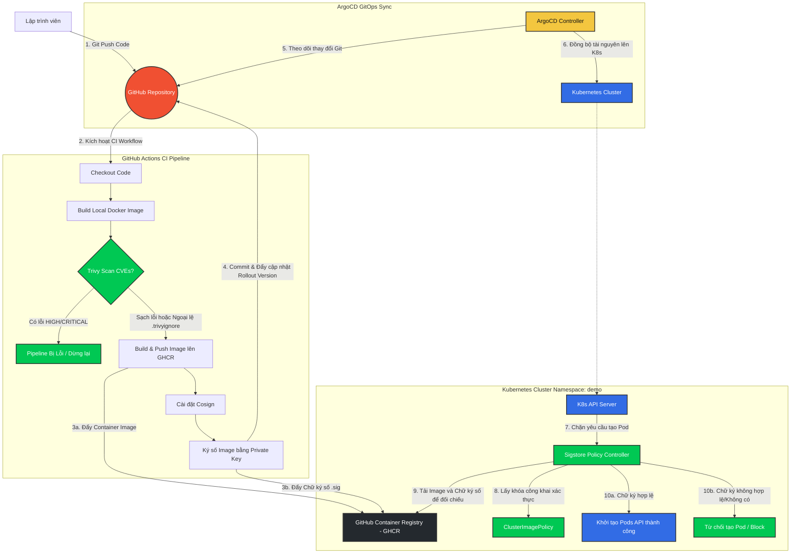

# Sơ đồ Kiến trúc Luồng Quét Lỗi, Ký Số và Xác Thực Image (Trivy + Cosign + Sigstore)

Tài liệu này mô tả chi tiết sơ đồ kiến trúc hệ thống, bao gồm các luồng chạy chính và cách thức liên kết giữa các thành phần từ khi lập trình viên đẩy mã nguồn lên Git cho tới khi ứng dụng được xác thực và khởi chạy trên Kubernetes.

---

## 1. Sơ đồ kiến trúc (Mermaid Diagram)

Dưới đây là sơ đồ luồng dữ liệu và tương tác giữa các hệ thống:

---

## 2. Giải thích chi tiết các Luồng Chạy (Flow Details)

Kiến trúc bao gồm **3 luồng chính** liên kết chặt chẽ với nhau:

### Luồng 1: Quy trình CI & Bảo mật hình ảnh (CI & Vulnerability Scan)
1. **Developer** commit code và push lên **GitHub Repository**.
2. GitHub Actions khởi chạy và bắt đầu quy trình build:
   - **Build Local Image**: Image được build cục bộ trên Runner trước.
   - **Trivy Scan**: Quét các lỗi bảo mật có mức độ `HIGH,CRITICAL`. Nếu phát hiện lỗi và lỗi đó không nằm trong danh sách bỏ qua của tệp `.trivyignore` (chứa ngoại lệ có thời hạn), pipeline sẽ lập tức bị báo đỏ và dừng lại.
   - **Push Registry**: Nếu vượt qua Trivy, image chính thức được build lại và đẩy lên **GHCR**.
   - **Cosign Sign**: Cosign sử dụng `COSIGN_PRIVATE_KEY` và `COSIGN_PASSWORD` được lưu trữ an toàn trong GitHub Secrets để thực hiện ký số lên image vừa đẩy lên, sau đó đẩy tệp chữ ký (dưới định dạng OCI artifact `.sig`) lên GHCR.
   - **Version Bump**: CI tự động cập nhật tag image mới vào cấu hình ứng dụng (`rollout.yaml`) và đẩy ngược lại mã nguồn lên Git.

### Luồng 2: Quy trình GitOps & Khai báo chính sách (ArgoCD & Policy Sync)
1. **ArgoCD** liên tục lắng nghe thay đổi của GitHub Repository.
2. Khi phát hiện thay đổi (bao gồm cả cập nhật chính sách hoặc cập nhật phiên bản image mới), ArgoCD thực hiện đồng bộ:
   - Đồng bộ **Sigstore Policy Controller** (Helm Chart) cài đặt webhook và tài nguyên giám sát.
   - Đồng bộ cấu hình **ClusterImagePolicy** chứa khóa công khai (`cosign.pub`) tương ứng của bạn.
   - Đồng bộ ứng dụng Rollout phiên bản mới lên Namespace `demo`.

### Luồng 3: Quy trình Xác thực deploy (Kubernetes Admission Verification)
1. Khi ArgoCD yêu cầu triển khai hoặc cập nhật Pod trong namespace `demo` (đã được gắn nhãn kích hoạt `policy.sigstore.dev/include: "true"`):
   - Yêu cầu tạo Pod được gửi tới **K8s API Server**.
   - API Server chuyển tiếp yêu cầu đến **Sigstore Policy Controller** thông qua cơ chế *Mutating/Validating Admission Webhook*.
2. Policy Controller đọc cấu hình quy định tại **ClusterImagePolicy**:
   - Xác định xem image của Pod đang dùng có khớp với mẫu quy định trong chính sách (`ghcr.io/pkhoa011004/w10-api*`) hay không.
   - Truy vấn lên **GHCR** để tải về tệp chữ ký số `.sig` đi kèm với image đó.
   - Sử dụng khóa công khai (`cosign.pub`) nhúng trực tiếp trong chính sách để xác thực chữ ký.
3. Ra quyết định:
   - **Thành công (Valid)**: Chấp thuận yêu cầu, API Server cho phép tạo và chạy Pod trong cụm.
   - **Thất bại (Invalid/Missing)**: Reject và trả về thông báo lỗi cấm chạy pod chưa được ký số an toàn.
